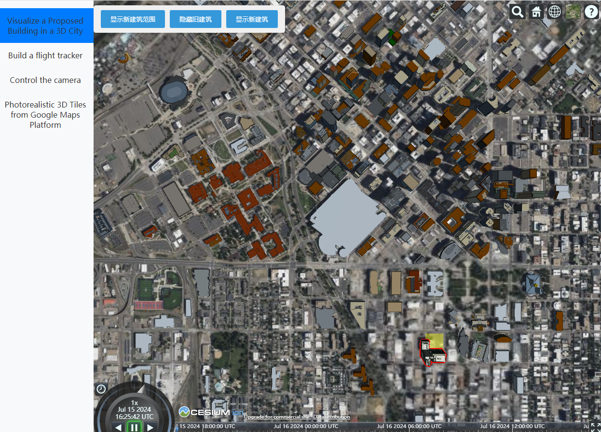
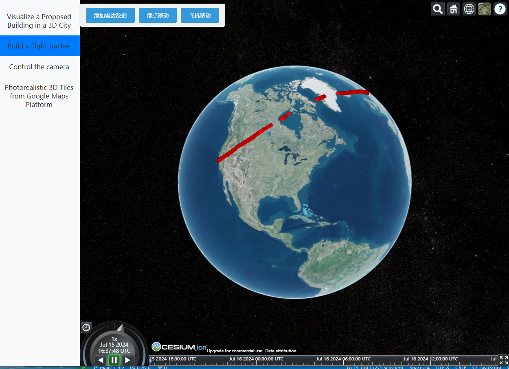

# 项目介绍

本项目是将CesiumJS官网教程中的html代码转为Vue3。
特点：
1 对教程代码需要使用cesium ion的地方进行调整，尽量使用本地文件，减少操作。

2 添加了很多操作方便一遍运行代码一遍分析代码。

3 搭配掘金博客https://juejin.cn/column/7386969940940980258可以更快了解CesiumJS官网教程。

页面



# 项目启动

1 修改Cesium Iontoken

在main.js文件中有设置Cesium Ion的token，强烈建议运行项目使用个人申请的Cesium Ion的token，不然访问ion服务时会很卡，用的人可能很多，申请token可以参考[【Cesium 入门】快速开始](https://juejin.cn/post/7388096340503494696)

```js
// main.js
Ion.defaultAccessToken = 'eyJhbGciOiJIUzI1NiIsInR5cCI6IkpXVCJ9.eyJqdGkiOiJlZDNiMDU1Yi0zNTM0L' + 
                          'TQ3ZGEtYTYwNy03NjExYjY5NGVjNTYiLCJpZCI6MTA1NDE2LCJpYXQiOjE2NjEwODc' + 
                          '2Mzl9.Tb0oUIPl1DsCS6BQDDvhTeImZI8PQDb1g3hX62SopF0';
```

2 运行项目

Project Setup

```sh
npm install
```

Compile and Hot-Reload for Development

```sh
npm run dev
```


# 项目使用

点击左侧的目录右侧出现相应的主题内容

举例：点击【Build a flight tracker】，右侧出现相关地图和控件

点击【添加雷达数据】显示相关数据



