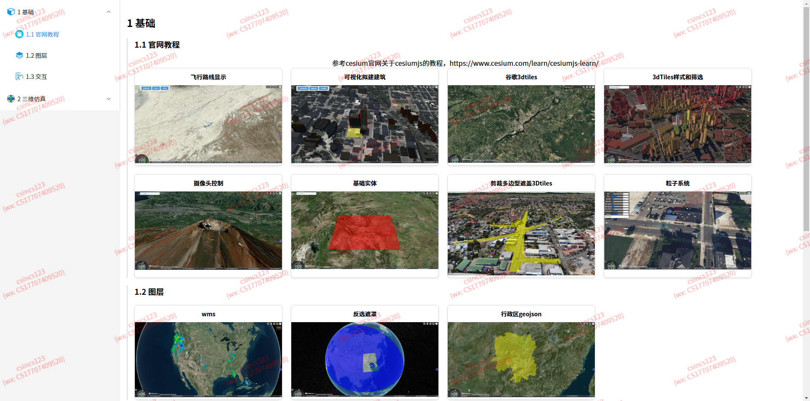
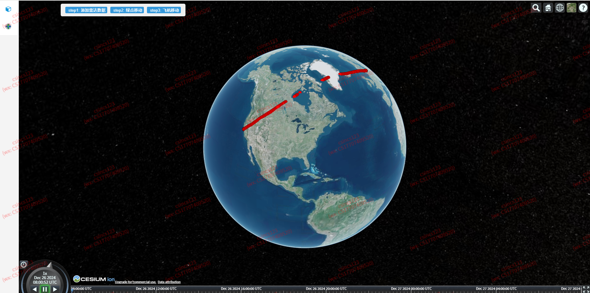

# CesiumJS-Learn

## 项目介绍

**项目内容**：展示CesiumJS的使用实例，参考[官网sandcastle](https://sandcastle.cesium.com/)，没有实时编码。
**项目框架**：vite + vue3。
**项目在线访问**： https://csincs123.github.io/cesiumjs-learn/。

搭配[掘金博客](https://juejin.cn/column/7386969940940980258)，博客文章对项目示例有详细描述，搭配食用更好。

**首页**



## 项目启动

1 修改Cesium Iontoken

在main.js文件中有设置Cesium Ion的token，强烈建议运行项目使用个人申请的Cesium Ion的token，不然访问ion服务时会很卡，用的人可能很多，申请token可以参考[【Cesium 入门】快速开始](https://juejin.cn/post/7388096340503494696)

```js
// main.js
Ion.defaultAccessToken = 'eyJhbGciOiJIUzI1NiIsInR5cCI6IkpXVCJ9.eyJqdGkiOiJlZDNiMDU1Yi0zNTM0L' + 
                          'TQ3ZGEtYTYwNy03NjExYjY5NGVjNTYiLCJpZCI6MTA1NDE2LCJpYXQiOjE2NjEwODc' + 
                          '2Mzl9.Tb0oUIPl1DsCS6BQDDvhTeImZI8PQDb1g3hX62SopF0';
```

2 运行项目

Project Setup

```sh
npm install
```

Compile and Hot-Reload for Development

```sh
npm run dev
```


## 项目使用

首页点击相应卡片，新建页面
例如：点击【飞行路线显示】，显示飞行路线页面


